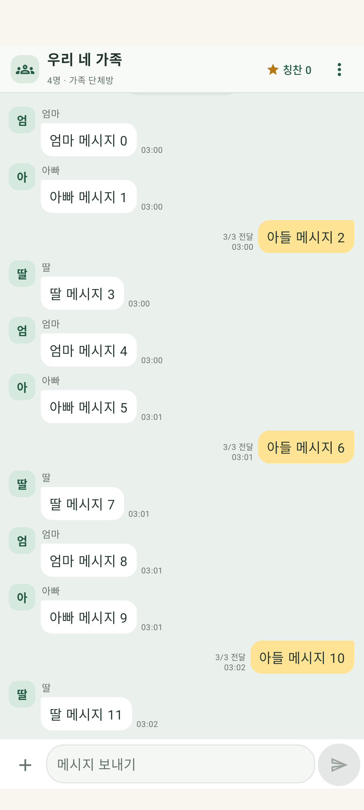
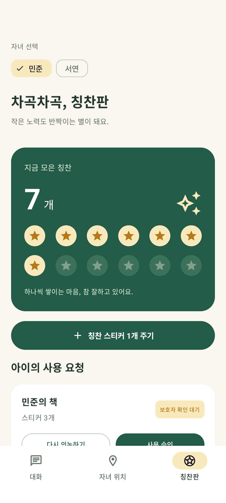

# 우리집 칭찬톡 · TalkingFamily 0.6.0

갤럭시 S23·S23 울트라 등에서 사용하는 가족 Android 앱입니다. **엄마·아빠·아들·딸 등 2~8명이 하나의 가족방에서 대화**하고, **부모 누구든 자녀별 위치와 칭찬판을 확인·관리**할 수 있습니다. 각 휴대폰이 자신의 텔레그램 봇으로 직접 통신하므로 별도의 가족 서버가 필요하지 않습니다.

## 가족 대화방 연결




위 화면은 에뮬레이터의 예시 대화입니다.

1. 모두 0.6.0 이상으로 업데이트하고, 휴대폰마다 서로 다른 봇을 준비합니다. 모든 봇에서 **Bot-to-Bot Communication Mode**를 켭니다.
2. 한 사람이 **가족방 관리 → 가족방 만들기**에서 방 이름, 본인의 이름·가족 관계, 다른 가족의 이름·관계·봇 `@사용자명`을 입력합니다. 기존 연결 기기는 저장한 자기 토큰을 재사용합니다.
3. 완성된 **가족방 코드**를 복사해 함께 참여할 가족에게 전달합니다. 코드는 가족 명단과 방 ID만 담고 봇 토큰을 담지 않습니다.
4. 다른 가족은 앱 첫 화면 또는 **가족방 관리**에서 코드를 붙여 넣고 명단을 확인한 뒤 참여합니다. 처음 연결하는 휴대폰은 **그 휴대폰의 봇 토큰**도 입력합니다.
5. 각 휴대폰에서 메시지 수신을 켭니다. 새 대화는 방 전체로 보내고, 말풍선 옆 **2/3 전달**은 다른 3대 중 2대가 저장했다는 뜻입니다. 사람이 읽었다는 뜻은 아닙니다.

부모는 위치·칭찬판 위쪽에서 아들 또는 딸을 선택합니다. 엄마와 아빠가 같은 자녀의 스티커 지급, 보상 편집, 사용 요청 승인을 함께 처리합니다. 같은 요청을 동시에 승인해도 한 번만 차감합니다. 자녀 휴대폰이 오프라인이면 변경은 대기하며, 연결 후 확정됩니다. 가족방 참여만으로 꺼진 자동 위치 공유를 켜지는 않습니다. 이미 공유 중인 자녀의 위치는 명단의 엄마·아빠에게 전달하고, 형제자매와 ‘가족’ 역할에는 전달하지 않습니다.

대화는 한 가족이 오프라인이어도 다른 가족에게 전송합니다. 예전 1:1 대화는 채팅 메뉴의 **기존 1:1 대화**에서 확인하며, 새 가족방으로 복사하지 않습니다.

가족 명단을 바꾸려면 현재 방에서 나간 뒤 새 방을 만들고 새 코드를 함께 사용합니다. 나간 방의 기록은 휴대폰에 남고, 같은 코드로 다시 참여하면 열립니다. 다른 사람이 방에서 나갔는지는 자동으로 알려주지 않습니다. 기존 1:1 연결은 별도로 유지됩니다. 자세한 설명은 [가족방 안내](docs/family-chat.md)를 보세요.

## 두 휴대폰 연결

1. 텔레그램 [@BotFather](https://t.me/BotFather)에서 `/newbot`으로 **자녀용·보호자용 봇 두 개**를 만듭니다.
2. **두 봇 모두 Bot-to-Bot Communication Mode를 켭니다.** [Telegram 공식 안내](https://core.telegram.org/bots/features#communication-in-private-chats)
3. 각 휴대폰에서 아래 정보를 입력하고 앱의 안내를 함께 확인한 뒤 연결합니다.

| 입력 항목 | S23 일반 | S23 울트라 |
| --- | --- | --- |
| 역할 | 자녀 | 보호자 |
| 이 휴대폰의 텔레그램 봇 토큰 | 자녀용 봇 토큰 | 보호자용 봇 토큰 |
| 상대방 봇 사용자명 | 보호자용 봇의 `@사용자명` | 자녀용 봇의 `@사용자명` |

각 토큰은 해당 휴대폰에만 입력합니다. **상대방 토큰, 가족 서버, Firebase 설정은 필요하지 않습니다.** 토큰은 Android Keystore로 보호해 보관하며 로그나 저장소에 올리지 않습니다. 봇 하나를 여러 프로그램에서 동시에 수신용으로 사용하지 마세요.

두 휴대폰의 **가족 연결 → 메시지 수신**을 켜고 대화를 주고받아 연결을 확인합니다. 자녀는 대화에 정확히 `설정`을 보내고 가족 연결을 선택합니다. 보호자는 칭찬판에서 가족 연결을 엽니다. 자세한 절차와 문제 해결은 [텔레그램 연결 안내](docs/serverless-setup.md)를 보세요.

## 메시지 수신과 기록

메시지 수신은 알림이 표시되는 Android 서비스가 텔레그램의 새 메시지를 확인하는 방식입니다. 수신 설정이나 서비스 알림에서 끌 수 있습니다. 끈 상태에서는 앱을 열어 새로 고침합니다. Firebase 푸시 서버를 운영할 필요가 없습니다.

앱 밖의 새 알림은 상대방의 대화 메시지만 표시합니다. 위치·칭찬 알림은 보내지 않으며 Android가 요구하는 수신·위치 공유·별 아이콘 실행 알림은 무음으로 표시합니다.

실행 알림을 숨기려면 **가족 연결 → 실행 알림 표시 설정**에서 해당 알림의 Android 설정을 열어 허용을 끕니다. 대화 메시지 알림과 실행 기능은 유지합니다. 자녀의 **자동 위치 공유 → 위치 공유 알림 표시 설정**에서도 위치 공유 알림을 숨길 수 있습니다. Android의 실행 중인 앱 목록이나 위치 사용 표시까지 앱이 없애는 기능은 제공하지 않습니다.

**상대 기기 수신**은 상대 앱이 기록을 저장하고 확인 응답을 보냈다는 뜻입니다. 사람이 읽었다는 뜻은 아닙니다. 확인 전에는 **전송 대기**로 표시될 수 있습니다. 오프라인 기록은 로컬 SQLite에 보관하고 재전송하며 중복 이벤트는 한 번만 적용합니다. 대화·칭찬·위치 데이터는 텔레그램을 거쳐 전달되고 각 휴대폰에 저장됩니다.

화면을 닫아도 받으려면 양쪽 휴대폰에서 메시지 수신을 켜 두세요. **절전, Android의 백그라운드 제한, 강제 종료, 재부팅과 인터넷 상태에 따라 수신이 늦어지거나 중단될 수 있습니다.** 항상 켜진 서버와 같은 수신 보장을 제공하지 않습니다. 중단되면 앱을 다시 열고 수신 상태를 확인하세요. 메시지 수신과 자동 위치 공유는 별개의 설정입니다.

## 앱에서 할 수 있는 일

- **대화:** 가족방에서는 이름별 말풍선, 연속 발신자 묶음, 작은 시간 표시와 접이식 빠른 답장으로 더 많은 메시지를 보여 줍니다. 지난 대화를 읽을 때 새 메시지가 와도 읽던 위치를 유지합니다. 기록은 200개씩 나눠 더 불러옵니다. 자녀가 정확히 `설정`을 입력하면 로컬 설정 메뉴가 열리며 이 명령은 전송되지 않습니다.
- **현재 위치 한 번 보내기:** 자녀 대화 화면의 현재 위치 공유 버튼을 누릅니다. 자동 위치 공유를 켜지 않아도 사용할 수 있습니다.
- **자동 위치 공유:** 자녀가 안내를 읽고 별도로 동의해 켠 경우에만 움직임이 없어도 약 5분마다 새 위치를 요청합니다. 필요한 위치·신체 활동·알림 권한을 요청하고 공유 중 알림을 표시합니다. 켜 둔 설정은 앱 재실행 때 이어가며, 자녀가 설정이나 알림에서 끄면 멈춥니다. 자동 위치 공유 설정에서 최근 자동 측정 시각과 보호자 기기의 수신 여부를 확인할 수 있습니다. 연결이나 메시지 수신만으로는 위치를 자동 수집하지 않습니다.
- **오르내림:** 기압계와 움직임으로 올라가기·내려가기의 시작과 종료를 각각 추정해 기록합니다. 정확한 층수나 계단·엘리베이터 여부를 판별하는 기능은 아닙니다.
- **GPS 흔들림 보정:** 자동 공유 중 Android 활동 인식으로 정지·걷기·차량 이동 등을 확인합니다. 정지 증거와 연속된 위치가 일치할 때 지도 표시 좌표를 고정해 작은 GPS 흔들림을 줄이고, 지도 안에 해당 기록 시점의 정지 추정 시간을 표시합니다. 실제 이동·오래된 활동 정보·측정 중단을 정지로 간주하지 않으며, 원본 GPS 값과 5분 기록은 유지합니다. 신체 활동 권한이 없으면 기본 위치 공유를 계속하고 자동 위치 공유 설정에서 권한을 허용할 수 있습니다. 보정 표시는 두 휴대폰을 0.4.4 이상으로 업데이트한 뒤 새로 받은 자동 기록에 적용됩니다.
- **칭찬과 약속:** 자녀마다 잔액·선물·사용 요청을 분리합니다. 엄마와 아빠 모두 스티커를 지급하고 선물 이름과 필요한 개수(1~999개)를 관리합니다. 자녀가 요청하고 부모 중 한 명이 승인하면 한 번 차감합니다. 다른 부모가 먼저 편집한 보상은 최신 내용을 받은 뒤 다시 편집합니다.
- **별 아이콘:** 다른 앱 위에 작은 별을 띄워 대화를 여닫습니다. 대화의 닫기 버튼은 별로 돌아갑니다. 켜 둔 설정은 일시적인 실행·표시 실패에도 유지하며, Android가 허용하면 복구하고 앱을 다시 열 때도 표시를 다시 시도합니다. 설정에서 **별 아이콘 끄기 → 별 끄기**를 확인해야 꺼지며, **켜 두기**나 뒤로 가기는 별을 유지합니다. 실행 알림에는 한 번 눌러 별을 끄는 동작을 두지 않습니다. 별을 켜거나 꺼도 자동 위치 공유는 바뀌지 않습니다. 표시 권한은 선택 사항이며, 별 자체는 GPS를 켜지 않습니다.

보호자의 **자녀 위치** 탭에서 날짜를 고르면 **지도 안에 시간별 위치와 점선 경로**가 표시됩니다. 지도 하단의 시간 막대나 좌우 버튼으로 기록을 선택하면 해당 시각의 위치로 이동합니다. **전체 경로**로 그날 불러온 기록을 한눈에 보고, **최신**으로 최근 위치를 선택할 수 있습니다. 점선은 기록된 위치를 이은 선으로 실제 도로 이동 경로와 다를 수 있습니다. 별도 지도 API 키 없이 지도 이동·확대·축소와 **표시 위치로** 이동을 사용할 수 있습니다. 측정 시간·좌표·위치 오차와 과거 위치 안내를 함께 표시하며, **기록 상세**를 펼치면 위치·오르내림 기록을 시간순으로 볼 수 있습니다. 지도 위의 자동 공유 상태 카드와 앱 상단의 일반 동작 안내 배너는 표시하지 않습니다. 입력 오류·전송 실패 안내는 확인할 수 있습니다.

위치·오르내림 기록은 휴대폰의 별도 SQLite 보관함에 쌓여 최근 대화 1,000개 범위에서 빠져도 남습니다. 날짜별로 나눠 불러오고 기록이 많은 날은 **이전 기록 더 보기**로 계속 확인합니다. 업데이트 시 남아 있는 기존 기록을 옮기며, 과거에 이미 삭제된 기록은 복구하지 못합니다. 가족 연결 초기화·재설정 시 기존 가족의 보관함도 지웁니다.

지도에는 인터넷 연결이 필요합니다. Leaflet 화면 코드는 APK에 포함하고, 화면에 보이는 지도 타일만 OpenStreetMap에서 불러옵니다. 지도 서버에는 열람 지역의 타일 요청과 IP 주소가 전달되며 봇 토큰·대화·자녀 이름은 전달하지 않습니다. 오프라인 지역 다운로드는 제공하지 않습니다. 지도 연결에 실패해도 앱에 저장된 좌표와 측정 시간은 볼 수 있습니다. 지도 데이터는 [© OpenStreetMap contributors](https://www.openstreetmap.org/copyright), 화면 라이브러리는 [Leaflet](https://leafletjs.com/)입니다.

## 설치·체험

[배포 APK](https://github.com/jinhoofkepco/TalkingFamily/releases/latest)에서 원하는 버전을 확인합니다. 이미 설치했다면 **앱을 삭제하지 말고 같은 서명의 새 APK를 그대로 설치**하세요. 고정 서명과 버전 번호 관리 방법은 [서명·업데이트 관리](docs/SIGNING.md)에 있습니다. 기존 서버 연결 정보로는 0.4.0에 연결할 수 없으므로 새 봇 연결 화면에서 설정합니다.

첫 화면의 **연결 없이 먼저 체험하기**는 예시 대화·위치·칭찬을 보여 줍니다. 실제 센서나 텔레그램 전송을 사용하지 않습니다. 체험 모드에서도 별 아이콘은 실제 화면 위에 표시할 수 있습니다. 자녀의 설정 → 가족 연결, 보호자의 칭찬판 → 가족 연결에서 체험 역할을 바꾸거나 체험을 마칩니다.

`ui-mockup/`과 기존 `docs/images/`는 이전 화면 검토 자료이며 최신 연결 화면은 Android 앱을 기준으로 합니다.

## 빌드와 검증

필요 환경은 **JDK 17, Android SDK 35**입니다. Android Studio에서 `android/` 폴더를 엽니다. 앱 빌드에 Node.js나 가족 서버는 필요하지 않습니다.

```sh
cd android
# local.properties에 sdk.dir=/내/Android/sdk 경로 설정
./gradlew :app:assembleDebug :app:testDebugUnitTest :app:lintDebug
# 테스트용 Android 기기 또는 에뮬레이터가 연결돼 있을 때
./gradlew :app:connectedDebugAndroidTest
```

가족 휴대폰용 업데이트 APK는 [서명 안내](docs/SIGNING.md)의 보존된 키로 `:app:assembleRelease`를 실행합니다. 임의의 새 서명으로 만든 APK는 기존 앱 위에 설치할 수 없습니다.

단위 테스트와 UI 테스트는 가족 4인의 전송·수신 확인, 일부 기기 오프라인과 재시도, 기존 데이터 이전, 약속 상태 처리, 이동·기압 정책과 화면 동작을 검증합니다. 전송 테스트는 가상 Telegram 응답을 사용합니다. 실제 봇 계정으로 여러 휴대폰에서 대화하기, One UI 절전 상태와 현장 센서 정확도는 별도로 확인해야 합니다. 자동화 테스트 통과가 실제 계정 연결 검증을 대신하지 않습니다.

## 위치와 개인정보의 한계

5분은 위치 제공자에 요청한 간격이며 Android가 정확한 측정·전달 시각을 보장하지 않습니다. 위치 기능이 꺼져 있거나 위치 신호·절전·통신 상태가 좋지 않으면 기록이나 전송이 늦어질 수 있습니다. GPS 정확도와 기압 기반 높이 추정은 실내 환경·날씨·휴대 방식에 영향을 받습니다.

자녀가 동의하고 켜 둔 공유 설정은 예상치 못한 앱 종료에도 유지합니다. Android가 허용하면 중단된 공유 서비스를 복구하며, 앱을 다시 열 때도 기존 설정에 따라 공유를 이어갑니다. 강제 중지·재부팅 후에는 앱을 다시 열어 주세요. 자녀가 직접 공유를 끄거나 가족 연결을 해제한 경우에는 자동으로 다시 켜지지 않습니다.

별 아이콘도 Android가 실행과 화면 위 표시를 허용해야 나타납니다. 앱 재실행 시 켜 둔 별을 복구해도 보고 있던 대화 화면을 닫지는 않습니다. 별을 직접 끈 경우에는 다시 켜지지 않습니다. 별 복구를 위해 별도의 배터리 예외 권한을 요구하지 않습니다.

텔레그램 봇 대화는 종단간 암호화 비밀대화가 아닙니다. 연결 해제는 이 휴대폰의 봇 토큰·연결 정보·앱 기록을 지웁니다. 상대 휴대폰과 텔레그램의 기록은 별도로 관리해야 합니다. 앱에서 보호자가 자녀의 자동 위치 공유를 원격으로 켤 수는 없습니다.

## 이전 서버 코드

`server/`와 [서버 안내](server/README.md)는 이전 버전의 중계 서버를 참고·보존하기 위한 자료입니다. **현재 앱 사용이나 설치에는 필요하지 않습니다.** 기존 서버용 `.env`, 기기 키, Firebase 서비스 계정은 새 연결 화면에 입력하지 않습니다.
